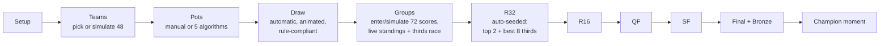

# WC Simulator — Master Plan

A client-side, 48-team FIFA World Cup 26™-format simulator with a broadcast-quality UI.
This document is the founding spec: product flow, the exact tournament rulebook the engine
implements, every algorithm (with genuine run-to-run variation), the full UI design language,
the architecture and data strategy, and the test/delivery roadmap.

It was produced by five parallel domain designs followed by an adversarial verification pass
(a FIFA-rules fact-checker with web access and a cross-section completeness critic). All 23
issues they raised — including five blockers — are resolved inline; the decision log in §6
records each resolution.

---

## 0. Product vision & flow

**One sentence:** pick (or simulate) the 48 qualified nations confederation-by-confederation,
seed them into pots (by hand or with one of five variation algorithms), watch a rule-perfect
animated draw build the 12 groups, enter or simulate every score, and the app carries the
tournament automatically — live standings with the full 2026 tiebreaker cascade, the best-thirds
race, automatic Round-of-32 seeding per FIFA's official bracket, and knockouts through the
Final and third-place match — all wrapped in a genuinely gorgeous "stadium night" interface
where every nation wears an open-source flag.



Core principles:

1. **The engine is pure and the store holds only inputs.** Standings, the thirds table, and the
   bracket are always *derived* — never stored — which makes editing the past tractable.
2. **Every random act flows through one seeded RNG** with named streams, so any simulated
   tournament is replayable and shareable from a short seed string.
3. **The rules are FIFA's rules.** Slot quotas, draw constraints, the 2026 head-to-head-first
   tiebreaker order, the Annexe C thirds allocation, match numbering 1–104 — implemented
   exactly, tested exhaustively, with the real 2026 tournament as a known-good oracle.
4. **Gorgeous is a requirement, not a garnish.** A complete token system, motion language, and
   taste rules are specified in §3 and reviewed at milestone M2, not deferred to "polish."

---

## 1. Tournament format & official rules (engine source of truth)

Verification status: items marked **[V]** were verified against web sources (FIFA.com articles,
major-outlet match reports, ticket listings exposing official match-number slots); items marked
**[M]** are from model knowledge and must be confirmed against the official *FIFA World Cup 26™
Regulations* PDF during the M1 data-capture task before hard-coding. Every real-2026 knockout
pairing cited below was cross-checked against the abstract slot definitions — they all match.

### 1.1 Confederation slot allocation (48 teams) [V]

| Confederation | Direct slots | Play-off entrants | Notes |
|---|---|---|---|
| UEFA | 16 | — | 12 group winners + 4 via UEFA play-off paths A–D (March 2026) |
| CAF | 9 | 1 → FIFA Play-Off Tournament | |
| AFC | 8 | 1 | |
| CONMEBOL | 6 | 1 | |
| CONCACAF | 3 hosts (MEX, CAN, USA) + 3 | 2 | |
| OFC | 1 | 1 | |
| **FIFA Play-Off Tournament** | — | 6 teams → **2 slots** | March 2026, Mexico. Two highest-FIFA-ranked entrants seeded straight to the two finals; other four play two semis. Single-leg, ET + pens. 2026 winners: **DR Congo** and **Iraq**. |

Guaranteed minimums: UEFA 16 / CAF 9 / AFC 8 / CONMEBOL 6 / CONCACAF 6 / OFC 1 = 46, plus 2
inter-confederation play-off slots. Actual 2026 distribution: UEFA 16, CAF 10, AFC 9,
CONCACAF 6, CONMEBOL 6, OFC 1.

**Selection validator (manual mode):** UEFA exactly 16; CAF ≥ 9, AFC ≥ 8, CONMEBOL ≥ 6,
CONCACAF ≥ 6 (three of which are the locked hosts), OFC ≥ 1; the 2 remaining flexible slots each
go to one of {CAF, AFC, CONMEBOL, CONCACAF, OFC} (CONCACAF may take both; UEFA may take
neither). **Simulated mode** models the FIFA Play-Off Tournament explicitly: 6 entrants
(1 AFC, 1 CAF, 1 CONMEBOL, 1 OFC, 2 CONCACAF), top-2-by-ranking byes to the finals, two semis +
two finals resolved by the match simulator (§2.6).

### 1.2 Final Draw rules (5 Dec 2025, Washington DC) [V]

**Pots** — 4 pots of 12 by the FIFA Men's World Ranking of 19 Nov 2025; the three hosts are
forced into Pot 1; all six play-off placeholders (UEFA paths A–D, FIFA PO 1–2) go to Pot 4
regardless of ranking. Real pots:

- **Pot 1:** Mexico, Canada, USA (hosts) + Spain, Argentina, France, England, Brazil, Portugal, Netherlands, Belgium, Germany
- **Pot 2:** Croatia, Morocco, Colombia, Uruguay, Switzerland, Japan, Senegal, Iran, South Korea, Ecuador, Austria, Australia
- **Pot 3:** Norway, Panama, Egypt, Algeria, Scotland, Paraguay, Tunisia, Côte d'Ivoire, Uzbekistan, Qatar, Saudi Arabia, South Africa
- **Pot 4:** Jordan, Cape Verde, Ghana, Curaçao, Haiti, New Zealand + the 6 placeholders

**Fixed host positions:** Mexico = **A1**, Canada = **B1**, USA = **D1**. Every other Pot-1 team
takes position 1 of the group it is drawn into.

**Constraints:**

1. **Confederation cap:** max **1** team per confederation per group…
2. **…except UEFA:** every group ends with **at least 1 and at most 2** UEFA teams (16 teams in
   12 groups ⇒ exactly four groups get a UEFA pair). No restriction on which pots a UEFA pair
   comes from — the real draw paired France (Pot 1) with Norway (Pot 3) in Group I and England
   (Pot 1) with Croatia (Pot 2) in Group L, and a correct constraint set must accept both
   (this is a pinned regression test).
3. **Top-4 seed bracket separation (new for 2026):** the four highest teams **by FIFA ranking**
   (2026: #1 Spain, #2 Argentina, #3 France, #4 England) are constrained so that #1/#2 land in
   groups whose *winner pathways* sit in opposite halves of the knockout bracket, and likewise
   #3/#4 — so all four can meet no earlier than the semifinals if they win their groups.
   Half-1 winner-groups = {D, E, F, G, H, I, K}; Half-2 winner-groups = {A, B, C, J, L}
   (derived from the bracket in §1.6; shipped as data). The real outcome respects it:
   Spain (H) vs Argentina (J); France (I) vs England (L). [V]
4. *(Simulated draws only, out of official scope)* If a custom pool makes a top-4 pair
   host-locked into the same half (hosts' groups are fixed), the engine drops the constraint
   for that pair and says so in a visible caption rather than failing the draw.

**Procedure:** draw Pot 1 → Pot 4; each drawn team goes to the **first group in A→L order**
that has an open slot for this pot and violates no constraint, *and* from which a completing
assignment still exists (feasibility lookahead, §2.5). **Group position is not the pot
number:** each group has a predefined pot→position pattern published with the draw procedures
(verified for Group A: pot 3 → A2, pot 2 → A3, pot 4 → A4 — Mexico–South Africa was MD1).
The full 12-group pattern table is captured in M1 and shipped as static data; until captured,
the Group-A pattern is the provisional default for all groups. Positions affect only fixture
order, never advancement. [V for Group A / M for the other 11]

**Real 2026 draw result (play-offs resolved):**

| Grp | 1 | + | + | + |
|---|---|---|---|---|
| A | **Mexico** | South Africa | South Korea | Czechia |
| B | **Canada** | Switzerland | Qatar | Bosnia-Herzegovina |
| C | Brazil | Morocco | Haiti | Scotland |
| D | **USA** | Paraguay | Australia | Türkiye |
| E | Germany | Ecuador | Côte d'Ivoire | Curaçao |
| F | Netherlands | Japan | Tunisia | Sweden |
| G | Belgium | Iran | Egypt | New Zealand |
| H | Spain | Uruguay | Saudi Arabia | Cape Verde |
| I | France | Senegal | Norway | Iraq |
| J | Argentina | Austria | Algeria | Jordan |
| K | Portugal | Colombia | Uzbekistan | DR Congo |
| L | England | Croatia | Ghana | Panama |

*(Scope decision: the app's preset is this post-playoff draw. Simulating the draw with
unresolved placeholder balls — which count as multiple confederations at once — is cut from
v1 scope; see decision log D9.)*

### 1.3 Group stage (matches 1–72)

- 12 groups of 4, single round-robin over 3 matchdays. Win 3 / draw 1 / loss 0. No extra time.
- **Matchday pattern by draw position** [V]: MD1: 1v2, 3v4 · MD2: 1v3, 4v2 · MD3: 4v1, 2v3.
  Both MD3 games in a group kick off simultaneously.
- Top 2 of each group + the **8 best third-placed teams** advance (32 of 48).

**Tiebreaker cascade (2026 — deliberately changed from 2022; head-to-head now comes first)**
[V via multiple 2026 press sources; confirm exact wording against Regulations Art. 13 in M1]:

Teams level on **points** form a tied class; within it, apply in order:

1. Points in the matches **among the tied teams** (head-to-head mini-table);
2. Goal difference in the matches among the tied teams;
3. Goals scored in the matches among the tied teams;
4. **Sub-table recursion:** if 1–3 separate some but not all, re-apply 1–3 restricted to the
   matches among each still-tied strict subset; [M — standard FIFA recursion wording]
5. Goal difference in **all** group matches;
6. Goals scored in all group matches;
7. **Conduct score** (lowest total deduction wins): yellow **−1**; second yellow / indirect red
   **−3**; direct red **−4**; yellow then direct red **−5** (one deduction per player per match,
   the worst applicable);
8. **FIFA Men's World Ranking** (19 Nov 2025 edition) — replaced drawing of lots for 2026;
9. *(Engine-only determinism fallback, should never fire on real data)* seeded lots.

**Third-place ranking (12-team cross-group table; top 8 advance)** [V]: 1. points; 2. goal
difference; 3. goals scored; 4. conduct score; 5. FIFA ranking; (6. seeded-lots fallback).
This table decides *who* advances; *where* they go is Annexe C (§1.5).

### 1.4 Round of 32 — official slot map (matches 73–88) [V, each row sourced]

8 group winners host third-placed teams; 4 winner-vs-runner-up pairs (C↔F, H↔J crossed);
4 runner-up pairs (A–B, E–I, D–G, K–L).

| Match | Home | Away | | Match | Home | Away |
|---|---|---|---|---|---|---|
| 73 | 2A | 2B | | 81 | 1D | 3rd of B/E/F/I/J |
| 74 | 1E | 3rd of A/B/C/D/F | | 82 | 1G | 3rd of A/E/H/I/J |
| 75 | 1F | 2C | | 83 | 1K | 3rd of D/E/I/J/L |
| 76 | 1C | 2F | | 84 | 1H | 2J |
| 77 | 1I | 3rd of C/D/F/G/H | | 85 | 1B | 3rd of E/F/G/I/J |
| 78 | 2E | 2I | | 86 | 1J | 2H |
| 79 | 1A | 3rd of C/E/F/H/I | | 87 | 2K | 2L |
| 80 | 1L | 3rd of E/H/I/J/K | | 88 | 2D | 2G |

Sanity checks (all verified): the candidate-set letters sum to exactly 40 (8 × 5); no third can
ever meet its own group's winner; per-letter availability: A {74, 82} · B {74, 81} ·
C {74, 77, 79} · D {74, 77, 83} · E {79, 80, 81, 82, 83, 85} · F {74, 77, 79, 81, 85} ·
G {77, 85} · H {77, 79, 80, 82} · I {79, 80, 81, 82, 83, 85} · J {80, 81, 82, 83, 85} ·
K {80} · L {83}. Note **3K can only go to match 80** and **3L only to match 83**.

### 1.5 Allocating the 8 thirds: Annexe C [V mechanism]

FIFA's Regulations contain **Annexe C**: a lookup table with one row per each of the
C(12,8) = 495 combinations of which 8 groups supply a qualified third; each row assigns the
eight thirds to matches 74, 77, 79, 80, 81, 82, 83, 85. Design principles: a third never meets
its own group's winner; thirds always play group winners; same-group teams cannot re-meet
before the quarterfinals.

Engine design:

1. **Fidelity mode:** ship the actual 495-row table as reviewed static data (from the
   Regulations PDF on `digitalhub.fifa.com` or Wikipedia's *2026 FIFA World Cup knockout
   stage*; both were network-blocked during research, so transcription is an M1 task).
2. **Fallback mode** (always constraint-correct; may differ from FIFA's canonical row):
   Hopcroft–Karp perfect matching on the 8×8 bipartite graph (qualified letters × host
   matches, edges = candidate sets), choosing the **lexicographically-first matching by
   third-place ranking** (highest-ranked third keeps its most-preferred legal slot) —
   deterministic, no RNG. This is the single canonical fallback (decision log D14).
   *Warning:* naive alphabetical greedy does **not** reproduce Annexe C.

**Test vector (real 2026):** qualified thirds {B, D, E, F, I, J, K, L} → 3D→74, 3F→77, 3E→79,
3K→80, 3B→81, 3I→82, 3L→83, 3J→85 (Germany–Paraguay, France–Sweden, Mexico–Ecuador,
England–DR Congo, USA–Bosnia, Belgium–Senegal, Portugal–Croatia, Switzerland–Algeria).

### 1.6 Knockout tree (matches 89–104) [V]

```
R16:  M89 = W74 v W77    M90 = W73 v W75    M91 = W76 v W78    M92 = W79 v W80
      M93 = W83 v W84    M94 = W81 v W82    M95 = W86 v W88    M96 = W85 v W87
QF:   M97 = W89 v W90    M98 = W93 v W94    M99 = W91 v W92    M100 = W95 v W96
SF:   M101 = W97 v W98   M102 = W99 v W100
M103 (third place) = Loser 101 v Loser 102        M104 (Final) = W101 v W102
```

Bracket halves (feeding constraint 3 in §1.2): Half 1 = M89/M90/M93/M94
(winner-groups D, E, F, G, H, I, K); Half 2 = M91/M92/M95/M96 (winner-groups A, B, C, J, L).

**Extra time / penalties** [V]: every knockout match (R32 through Final, including the
third-place match) level after 90' goes to 2 × 15' extra time, then a penalty shoot-out.
No away goals, no golden goal, no group-stage extra time. UX: a drawn knockout scoreline
requires an ET score; if still level, a shoot-out score.

**Match numbering:** 1–72 group stage, 73–88 R32, 89–96 R16, 97–100 QF, 101–102 SF,
103 bronze, 104 final — 104 total. `schedule.ts` is the single owner of the mapping
match number → (group, matchday, position pair) (see §4.3).

### 1.7 Real-2026 preset & oracle data [V]

The tournament has concluded, so the app ships the full real dataset as both a preset and an
end-to-end test oracle (re-verified during M1 data capture):

- **Qualifiers, pots, draw:** §1.1–§1.2 above. Notable absentee: Italy (lost play-off A final
  to Bosnia-Herzegovina).
- **Group outcomes (1st / 2nd / qualified 3rd):** A Mexico / South Africa / — · B Switzerland /
  Canada / Bosnia · C Brazil / Morocco / — · D USA / Australia / Paraguay · E Germany /
  Côte d'Ivoire / Ecuador · F Netherlands / Japan / Sweden · G Belgium / Egypt / — ·
  H Spain / Cape Verde / — · I France / Norway / Senegal · J Argentina / Austria / Algeria ·
  K Portugal / Colombia / DR Congo · L England / Ghana / Croatia. Qualified thirds:
  {B, D, E, F, I, J, K, L}.
- **Knockout results:** R32 — M73 South Africa 0–1 Canada; M74 Germany 1–1 Paraguay (p 3–4);
  M75 Netherlands 1–1 Morocco (p 2–3); M76 Brazil 2–1 Japan; M77 France 3–0 Sweden;
  M78 Côte d'Ivoire 1–2 Norway; M79 Mexico 2–0 Ecuador; M80 England 2–1 DR Congo;
  M81 USA 2–0 Bosnia; M82 Belgium 3–2 Senegal (aet); M83 Portugal 2–1 Croatia;
  M84 Spain 3–0 Austria; M85 Switzerland 2–0 Algeria; M86 Argentina 3–2 Cape Verde (aet);
  M87 Colombia 1–0 Ghana; M88 Australia 1–1 Egypt (p 2–4). R16 — M89 France 1–0 Paraguay;
  M90 Canada 0–3 Morocco; M91 Brazil 1–2 Norway; M92 Mexico 2–3 England; M93 Portugal 0–1
  Spain; M94 USA 1–4 Belgium; M95 Argentina 3–2 Egypt (aet); M96 Switzerland 0–0 Colombia
  (p 4–3). QF — M97 France 2–0 Morocco; M98 Spain 2–1 Belgium; M99 Norway 1–2 England;
  M100 Argentina 3–1 Switzerland. SF — M101 France 0–2 Spain; M102 England 1–2 Argentina.
  Bronze M103 England 6–4 France. **Final M104: Spain 1–0 Argentina (aet, Ferran Torres
  106').**
- **Still to capture in M1** (required for "load preset to any stage"): all 72 real group-stage
  scorelines, the official 1–72 match-number list, the 12 per-group pot→position patterns, and
  the 495-row Annexe C table. If the 72 group scorelines prove uncapturable, the preset's
  definition of done downgrades *now* (decision log D18) to post-draw + knockout-only replay.

---

## 2. Simulation algorithms

All randomness flows through one seeded RNG; every stochastic algorithm takes an explicit
`rng` stream and a **chaos knob** θ ∈ [0, 2] (0 = chalk, 1 = realistic, 2 = mayhem). Nothing
calls `Math.random()` — enforced by lint.

### 2.1 Seeded RNG

**Pinned design: xmur3 string hash → mulberry32 PRNG** (splitmix32 explicitly rejected to
protect seed compatibility — changing the PRNG ever would break replay of shared seeds).

```
makeRng(seedString):  state = xmur3(seedString)();  return mulberry32(state)
stream(masterSeed, name):  return makeRng(masterSeed + " " + name)
  # names: "qual" | "seed" | "draw" | "match:<matchNumber>" | "lots:<ctx>"
```

- **One user-visible master seed string** (e.g. `"K7X2-M9QD"`, minted from
  `crypto.getRandomValues`, editable — typing `"MESSI2026"` replays identically).
- **Named derived streams** per pipeline stage: re-running one stage (re-draw) never perturbs
  another; per-match streams make simulate-button results order-independent (simulating match
  37 gives the same score whether or not match 12 was simulated first).
- Primitives on top: `uniform`, `randInt`, `gaussian` (Box–Muller), `poisson` (Knuth),
  `shuffle` (Fisher–Yates), `weightedPickWithoutReplacement`.

**Chaos is per-stage** (decision log D12): `chaos: { qualification, seeding, match }`, each
θ ∈ [0, 2]. UI sliders show 0–100; **θ = slider / 50** (50 = realistic). Each slider defaults
to the last-touched value so casual users experience one global knob.

**Determinism contract:** `(masterSeed, chaos{q,s,m}, seedingStrategy, overrides[])` ⇒
bit-identical tournament. Manual edits are recorded in an override log so hybrid
manual/simulated tournaments replay exactly.

### 2.2 Team-strength model

`nations.json` is the **single dataset** (decision log D16) — one record per FIFA nation
(~211): `{ id, name, shortName, flagCode, confederation, fifaRank, rating, form }`. The
`rating` field is the blended strength **R**, computed at build time from a non-shipped input
file carrying raw `elo` (eloratings.net) and `fifaPts` (official ranking points):

```
R = 1500 + 175 · (0.6 · zElo + 0.4 · zFifa)        # z-scored blend, Elo-like units
R̃ = (R − 1500) / 175                               # unit-variance form for softmax exponents
```

`form` is the 12-month Elo delta (used only by the Form seeding strategy). Chaos→temperature
mapping shared by all samplers: weight `w_i = exp(β(θ) · R̃_i)` with `β(θ) = 1.4 · 3^(1−θ)`;
**θ = 0 short-circuits to deterministic argmax/top-k** (no sampling, no overflow).

> Official-procedure fidelity note: anywhere the *rules* reference team quality (pot order in
> the Official strategy, the top-4 separation constraint, tiebreaker rung 8), the engine uses
> **fifaRank**, never the blended R. R exists only for sampling and match simulation.

### 2.3 Qualification simulator — `completeQualification(partial, θ, rng)`

Fills only the **unfilled** slots, respecting manual picks (decision log D11):

1. Subtract manual picks from each confederation's pool and quota; hosts are unconditional
   locks charged to CONCACAF. Manual overflow beyond a confederation's base quota consumes the
   flexible slots (validated: flexible slots only from CAF/AFC/CONMEBOL/CONCACAF/OFC, max 2
   total, UEFA never).
2. Per-confederation **Plackett–Luce sampling without replacement**, implemented as
   Gumbel-top-k: `key_i = β(θ)·R̃_i + gumbel(rng)`; take top-k by key (θ = 0 → plain top-k
   by R).
3. **FIFA Play-Off Tournament simulation** for remaining flexible slots: sample 6 entrants
   (1 AFC / 1 CAF / 1 CONMEBOL / 1 OFC / 2 CONCACAF) from the best not-yet-qualified via the
   same sampler; top-2 by ranking get byes to the finals; semis + finals resolved by the match
   simulator (§2.6) so play-off drama inherits the chaos knob. The mini-bracket is surfaced as
   a result log ("New Zealand beat Bolivia 2–1 aet") — cheap flavor, high delight.

Variation guarantee: at θ = 1, mid-table nations flip between runs constantly while elites are
near-locks; at θ = 2, expect 2–4 genuine shockers per confederation per run.

### 2.4 Seeding strategies (pots of 12)

Canonical set — five strategies, one signature (decision log D8):
`seedPots(entries, strategyId, θ = chaos.seeding, rng) → Pot[4]`. Invariants: hosts always
Pot 1 (with fixed positions MEX→A1, CAN→B1, USA→D1); output is 4 × 12. Manual drag-and-drop is
a **layered override on any strategy's output**, not a strategy.

| id | UI label | Character | Definition |
|---|---|---|---|
| `official` | Official | Deterministic chalk — the control group | Sort non-hosts by fifaRank; Pot 1 = hosts + top 9; pots 2–4 = next 12 each. Zero RNG; ties by fifaRank then alphabetical. |
| `noisy` | Noisy Ranking | Realistic wobble around the official pots | `R′ = R + σ(θ)·gaussian(rng)`, σ(θ) = 40·θ (≈ one pot-boundary gap); hosts exempt; sort & slice. θ=0 degenerates to Official; θ=1 shuffles within ±1 pot; θ=2 lets a Pot-2 team hit Pot 4. |
| `pl-draft` | Luck of the Draft | Fat-tailed; occasional Pot-1 gatecrasher | Sequential softmax picks, Pot 1 filled first: repeatedly draw from Categorical(w_i = exp(β(θ)·R̃_i)). Early-draft luck compounds — correlated anomalies jitter can't produce. |
| `form` | Form | Rewards hot streaks, punishes decline | `R″ = R · clamp(1 + form/200, 0.85, 1.15)`, then run `pl-draft` on R″ with β(max(θ, 0.5)) so it stays stochastic even at θ=0. |
| `chaos` | Full Chaos | Brazil in Pot 4 is on the table | `shuffle(nonHosts, rng)`; first 9 join hosts in Pot 1, rest fill pots in shuffle order. Ignores θ. |

Live validation on the pots at all times: 12 per pot; hosts locked (hard); a **feasibility
linter** runs the §2.5 `feasible()` check and warns "this seeding admits no legal draw" —
naming the offending confederation — *before* the user hits Draw.

### 2.5 The draw — constraint satisfaction with feasibility lookahead

Replicates FIFA's procedure exactly, so the animated draw provably never dead-ends.

Constraints as predicates over a partial assignment:

```
C1 confed cap:   count(group, confed) ≤ 1 for confed ≠ UEFA
C2 UEFA band:    count(group, UEFA) ≤ 2 during the draw; final assignment ≥ 1 per group
C3 host anchors: MEX→A1, CAN→B1, USA→D1 (pre-placed)
C4 top-4 split:  top 4 by fifaRank; #1/#2 in opposite bracket halves, #3/#4 likewise —
                 encoded as allowedGroups[team] from the static group→half map (§1.6);
                 host-locked infeasible pairs drop the constraint with a visible caption
```

```
runDraw(pots, rng = stream(seed, "draw")):
    state = placeHosts(pots);  assert feasible(state)      # pre-check, named violation on fail
    for pot in 1..4:
        for team in shuffle(pots[pot] − placed, rng):       # the ball draw
            for g in A..L:                                  # FIFA's sequential rule
                if slotOpen(g, pot) and C1..C4 hold
                   and feasible(state + place(team, g)):
                    place(team, g); emit DrawPick; break
```

`feasible()` is two layers: (1) a within-pot **Hall check** — Hopcroft–Karp perfect matching of
remaining teams × open groups (microseconds at V ≤ 24); (2) a **cross-pot backtracking DFS**
over all remaining pots (needed because UEFA's ≥1-per-group lower bound binds across pots),
pruned by the Hall check and per-confederation counting bounds, memoized on a canonical state
key. Empirically the whole draw computes in a few milliseconds, then plays back as the slow
animated reveal. Group position comes from the per-group pot→position pattern table (§1.2),
not the pot number.

Edge case: user-manual or Full-Chaos pots can be globally infeasible; the pre-check catches
this before any animation starts and reports the failing constraint in plain language.

### 2.6 Match-score simulator (optional, per-match dice button)

```
simulateMatch(A, B, knockout, θ = chaos.match, rng = stream(seed, "match:" + matchNumber)):
    Δ  = (R_A − R_B) / 175
    λA = 1.30 · exp(+0.45·Δ / T(θ));  λB = 1.30 · exp(−0.45·Δ / T(θ));  T(θ) = 3^(θ−1)
    shared = poisson(0.10);  gA = poisson(λA − 0.10) + shared;  gB = poisson(λB − 0.10) + shared
    # bivariate Poisson (Karlis–Ntzoufras); λ−λ3 clamped ≥ 0.05; θ=0 stays stochastic, just chalky
    if not knockout or gA ≠ gB: return (gA, gB)
    extra time at 1/3 intensity; if still level: best-of-5 shootout + sudden death
    # per-kick p = 0.75 ± 0.03·tanh(Δ); sudden death capped at 30 rounds → seeded lots
```

Calibration anchors (pinned by tests, §5.3): a 300-Elo favorite wins ~78% at θ = 1; mean total
goals ≈ 2.5–3. The same function powers the qualification play-off, per-match dice, and
"simulate remaining" bulk actions. Simulated scores are editable and marked with a dice icon.

### 2.7 Standings engine — the 2026 cascade, exactly

Pure function `standings(group, matches) → StandingRow[4]`; recomputed live; safe on partial
data (0–6 matches). Implements §1.3 **verbatim** (head-to-head first — this is the 2026 change;
a test fixture that *fails under the 2022 order* pins it):

```
rankGroup(teams, matches):
    rows = aggregate(teams, matches)                 # P W D L GF GA GD Pts (+conduct if cards entered)
    order by Pts desc                                # tie classes form on points ONLY
    for each maximal tied class T (|T| ≥ 2):
        resolve T by, in order:
          h2h points → h2h GD → h2h GF   (matches among T only)
          sub-table recursion on each still-tied strict subset
          overall group GD → overall group GF
          conduct score (−1/−3/−4/−5; 0 when no cards entered)
          fifaRank
          seeded lots (stream "lots:<groupId>") — absolute last resort, UI-badged
    return rows, each annotated decidedBy: 'points'|'h2h'|'gd'|'gf'|'conduct'|'fifaRank'|'lots'
```

**Third-place table:** computed **live over provisional standings of all 12 groups** during the
group stage (rows from unfinished groups marked provisional — this panel is the tension engine
of the group stage, decision log D13); ordered by Pts → GD → GF → conduct → fifaRank → seeded
lots (`"lots:thirds"`). Top 8 advance. Only **R32 bracket generation** is gated on all 72 group
matches having results.

### 2.8 Contention & elimination math — `contention.ts`

The UI's `Q` / `3rd?` / `OUT` badges are scenario claims, not current-table claims, so they get
a defined algorithm (decision log D10): per group, enumerate the ≤ 3^k W/D/L outcomes of the
k remaining matches (k ≤ 6 ⇒ ≤ 729, trivially brute-forceable), **points-only**. A team is
badged `OUT` of the top-2 only when no outcome gives it points ≥ the second-best other team
(ties count as reachable, since goals could break either way — a conservative proof that never
shows OUT while a team is alive). Thirds-race contention compares the team's max-attainable
third-place points against the pessimistic 8th-best guaranteed-minimum across other groups'
thirds — same conservative direction. Badge copy stays honest: `OUT` only on proof, hollow
`3rd?` otherwise.

### 2.9 Bracket seeding & propagation

`seedRoundOf32(groupTables[12], thirdsTable) → populates matches 73–88` from the static
bracket template (§1.4) + Annexe C (§1.5). There is **one knockout model** (decision log D7):
matches keyed by FIFA match number with `TeamSource` wiring per §1.6 — including
`matchLoser 101/102 → M103`. No parallel bracket array. Propagation and edit-invalidation are
the selector-based recompute over match numbers described in §4.2, with `previewInvalidation()`
powering the confirm dialog before any destructive edit.

Everything is interactive-instant: the heaviest path (draw feasibility DFS) is < 5 ms total;
all other algorithms are O(n log n) with n ≤ 211. Ties on *everything* resolve by seeded lots
at every level — always deterministic per seed, always visibly badged.

---

## 3. UI & experience design

### 3.1 Design language — "Stadium Night"

The default theme evokes a floodlit pitch seen from the broadcast gantry: deep green-black
surfaces, warm off-white text, one champagne-gold accent reserved for moments that matter.
FIFA broadcast graphics crossed with a premium editorial site — dense information presented
calmly. It must never read as a dashboard template.

**Dark (default):**

| Token | Hex | Use |
|---|---|---|
| `--bg-0` | `#0A0F0D` | App background (green-ink near-black) |
| `--bg-1` | `#101713` | Cards, panels |
| `--bg-2` | `#182119` | Raised elements, hover rows, popovers |
| `--bg-3` | `#202B22` | Active/pressed, selected row |
| `--line-1` / `--line-2` | `#26312A` / `#39463D` | Hairlines / emphasized borders |
| `--text-hi` / `--text-mid` / `--text-low` | `#F2EFE6` / `#A9B2A9` / `#6E786F` | Text hierarchy (never pure #FFF) |
| `--gold` / `--gold-hi` / `--gold-dim` | `#D2B064` / `#E5C87F` / `#8A7443` | Signature accent / hover & display numerals / subdued |
| `--pitch` | `#1E5C40` | Secondary green — hero washes, draw-stage backdrop only |
| `--pos-adv` / `--pos-third` / `--pos-out` | `#4CA96E` / `#C9973F` / `#8A5A5A` | Qualification states (brick, deliberately not alarm-red) |
| `--danger` / `--focus` | `#D06A5C` / `#E5C87F` | Destructive & errors / 2px focus ring, 2px offset |

**Light ("Matchday Paper"):** `--bg-0 #FAF8F2`, `--bg-1 #FFFFFF`, `--bg-2 #F1EEE4`,
`--bg-3 #E7E3D6`; lines `#E0DCCE`/`#C9C4B2`; text `#161A17`/`#4E564F`/`#828A82`; gold
`#8A6D2F` (small text) / `#A5842F` (large display) / `#C9B98A`; `--pos-adv #25764B`,
`--pos-third #9A6E1F`, `--pos-out #9A5B52`, `--danger #B4453A`.

Contrast: gold-on-dark ≈ 8.9:1; light-mode small gold `#8A6D2F` ≈ 5.2:1; body text ≥ 7:1.
Qualification colors appear as fills behind dark text or 3px position bars — never as sole
small-text color.

**Typography** (self-hosted open-source via Fontsource, no CDN):
- **Barlow Condensed** (500/600/700) — display: scorelines, group letters, big numerals, team
  names in bracket nodes and draw reveals. Uppercase, `letter-spacing: 0.02em`,
  `tabular-nums` on scorelines. (Known risk: sparse extended-Latin diacritics — fallback is
  Archivo Condensed if a team name renders wrong.)
- **Inter** (400/500/600 variable) — everything else; `tabular-nums` on every stat column.
- **Fraunces** (500 italic) — exactly two appearances: landing hero overline and champion
  headline. Nowhere else.
- Type scale (rem, 16px base): 12 / 13 / 14 / 16 / 20 / 24 / 32 / 44 / 64 / 96.

**Space, radius, elevation, texture:** 4px spacing base (4→96); radius 4 chips, 8 inputs,
12 cards, 16 modals, 999 pills & flag rings — nothing else. Dark-mode elevation is borders +
luminance, not shadows; popovers/modals add `0 16px 48px rgba(0,0,0,.5)`. One fixed SVG-noise
overlay on `--bg-0` at 2.5% opacity (feTurbulence tile) for print-like grain.
`backdrop-filter: blur(20px)` permitted in exactly two places: sticky app bar, draw-stage
overlay.

**Taste rules (what we will NOT do):** no gradient text, neon glows, or gradient buttons —
gold is a flat fill or 1px border; max one gold-filled element per viewport region; no
shadows/bevels/gloss on flags; no animated backgrounds during data entry; no emoji in chrome
(icons: Lucide, 1.5px stroke, `--text-mid`); no pure black/white; confetti exactly once in the
entire product.

### 3.2 Flag treatment

**Primary: HatScripts/circle-flags** (MIT, GitHub-sourced, 1:1 circular SVGs, vendored at
build time — no runtime CDN). Circles make all 48 nations optically uniform regardless of
aspect ratio and compose perfectly into pots, balls, tables, and bracket chips.
**lipis/flag-icons** (MIT) 4:3 serves as the "hero" flag on match headers/team panels, and as
a clipped fallback for any code circle-flags lacks.

Ring spec (one `.flag` wrapper everywhere): SVG clipped to a circle + 1px inner keyline
(`rgba(255,255,255,.14)` dark / `rgba(20,26,23,.18)` light) + 2px surface-color gap when
sitting on imagery; selected/qualified adds an outer 2px `--gold` ring. Never scale a flag on
hover. Sizes: 20 chips · 24 list rows & bracket nodes (20 phone) · 28 pot/standings rows ·
32 match rows · 64 match-header hero · 80 draw ball · 96 champion. Every flag carries the full
country name as `alt`/`aria-label`. Missing/failed art degrades to a monogram disc (FIFA
trigraph in the display face) — never a broken image.

### 3.3 Screens

**Global chrome.** Sticky 64px app bar (blurred `--bg-0` at 85%): wordmark "WC26 SIMULATOR"
(Barlow Condensed 600) · center stepper `Setup · Teams · Pots · Draw · Groups · Knockout` ·
theme toggle + save/load. Stepper discs: completed = gold outline + check; active = gold fill;
future = outline. **Navigation is decoupled from phase** (decision log D15): every step is
viewable read-only at any time; FSM guards gate *editing and advancing* only. Content
max-width 1440px, 12-col grid.

**(a) Landing / setup.** Full-viewport hero on `--bg-0` with a faint `--pitch` radial wash +
grain; Fraunces overline "The 48-team era," Barlow Condensed 96 headline "SIMULATE THE 2026
WORLD CUP." Three setup cards: **Real 2026** (the concluded tournament as a preset — loadable
to post-draw, post-groups, or full-replay stage), **Custom** (full flow), **Full Chaos**
(one click simulates everything to a champion; user then explores/edits). Quiet "Load saved
tournament" link beneath. Primary CTA: gold fill, `--bg-0` text, radius 8, height 44.

**(b) Team selection.** Two panes. Left rail (320px, sticky): six confederation quota meters
as **min + flex segments** (e.g. CAF renders "9 + up to 2 flex" — base segments gold when
filled, flex segments amber), a "37 / 48" counter in Barlow 32, and the **Auto-simulate**
panel: gold-outline "Simulate qualification" button + chaos slider (0–100: "Chalk" /
"Real-world upsets" / "Anarchy") + re-run dice. Simulation calls `completeQualification` —
fills *unfilled* slots only, honoring manual picks and flex-slot consumption. Right pane:
confederation tabs (UEFA · CAF · AFC · CONCACAF · CONMEBOL · OFC · **Play-offs** — the
play-offs tab is the picker for the 2 flexible slots, showing which confederations may still
claim them), `/`-focusable search, responsive team-card grid (24px flag, name, FIFA-rank
chip; selected = `--bg-3` fill + gold flag ring). Hosts pre-locked with a padlock chip.
Over-quota attempts shake the meter (2px, 200ms, danger tint) with an inline explainer.
Sticky footer CTA disabled with reason text until exactly 48.

**(c) Seeding room.** Header: "SEEDING" + **strategy picker** segmented control —
`Official · Noisy Ranking · Luck of the Draft · Form · Full Chaos` (the five §2.4 strategies,
decision log D8) — a chaos stepper where applicable, and a **Re-roll** dice (250ms cross-fade
reshuffle, meaningfully different pots each press). Body: four pot columns (level-1 cards,
"POT 1" + 12/12 count), 48px drag-and-drop rows (grip dots, 28px flag, name, rank chip).
Drag: lift scale 1.02 + level-2 shadow; gold insertion line; dropping into a full pot swaps.
Keyboard DnD: `Space` lift, arrows move, `Space` drop. The feasibility linter (§2.4) surfaces
"this seeding admits no legal draw" warnings inline before Draw unlocks. Hosts pinned to
Pot 1 (caption states the rule).

**(d) The Draw — the set-piece.** Entering dims the chrome into a full-viewport stage
(`--bg-0` deepened, `--pitch` radial floor glow, grain, the second sanctioned blur). Left
third: reveal zone — pot label ("DRAWING POT 1 — 5 OF 12"), the ball, last-three ticker.
Right two-thirds: the group board — 12 group cards (A–L) in 4×3, empty slots as dashed circles
with pot watermarks. Controls: `Draw next` (also `Space`), auto-play 1×/2×, and **Skip to
result** — always visible, never buried. When constraints skip a group, skipped headers flash
a subtle amber underline with a one-line reason ("Group C blocked: already has a UEFA pair") —
the constraint system is *visible*, which is half the delight. Completion: board exhales
(0.98→1.0, 400ms), controls swap to "Continue to Group Stage" + ghost "Redraw."

Per-team reveal choreography (~2.4s at 1×): ball rises with spring ease (0–400ms) → flips
rotateY to reveal the 80px flag (400–650) → **hold** — name stamps in, chips fade (650–1250;
nothing else moves) → destination group underlines in gold; skipped groups flash first
(1250–1550) → flag shrinks to 28px and flies to its slot (1550–1850) → settle, ticker updates,
next ball pre-loads (1850–2400). 2× halves everything; Skip commits final state in one 250ms
board fade; `prefers-reduced-motion` collapses each reveal to a 150ms fade.

**(e) Group stage hub.** Matchday switcher `MD1 · MD2 · MD3 · All` + `Groups / Matches` view
toggle; toolbar: "Simulate remaining" (chaos popover), "Clear all scores" (danger, confirms).
Twelve group cards (4×3, min 320px): header "GROUP A" (gold letter, Barlow 24); standings
table (Pos, 28px flag, team, P W D L GF GA GD Pts, 13px `tabular-nums`); beneath, the selected
matchday's fixtures as inline score rows. Standings rows carry a 3px position bar + text
badge: rows 1–2 `--pos-adv` + `Q`; row 3 `--pos-third` + `3rd?` while in contention (hollow
when not); `OUT` appears only on the §2.8 points-only proof. Ties broken beyond points show a
small ⓘ opening a popover narrating the applied rung from `decidedBy` ("Level on points;
Japan ahead on head-to-head"). Rows reorder via FLIP (300ms) on commit only, never per
keystroke.

**Score row anatomy (used everywhere):** `[flag 32][ABBR] [score][–][score] [ABBR][flag 32]`
+ per-match dice (simulate respects relative strength) + overflow ("clear score", "simulate
rest of group"). Fields are 44×44, Barlow 24, `–` placeholder in `--text-low`. A collapsed
**Discipline** sub-panel in the match slide-over offers optional card entry (Y / 2Y / R / Y+R
counters per team) feeding the conduct tiebreaker (decision log D17); untouched, conduct
defaults to 0 and the cascade skips through it honestly.

**(f) Best-thirds race panel.** Right slide-over (420px; bottom sheet on mobile; hotkey `T`;
pinned toolbar toggle "3RD PLACE RACE"). A single ranked table of all 12 third-placed teams —
**live from the group stage's first entered score**, provisional rows (hollow "in play" dot +
"Standings provisional — 3 groups still playing" caption) for unfinished groups. A hard gold
rule under row 8 labeled "QUALIFICATION LINE"; rows 1–8 `--pos-third` bar + `Q`, rows 9–12
`--pos-out` + `OUT` (per §2.8 proof). Rows crossing the line FLIP (300ms) and pulse once.

**(g) Knockout bracket.** Full 32-team tree, left and right wings converging on a center Final
column (Final card + smaller third-place card beneath). Connectors: 1px `--line-1`, upgraded
to 1.5px `--gold-dim` along a team's actual advancement path — the champion's road glows gold
by the end. Match node (200×88): two team rows (24px flag, abbr, score Barlow 20) + footer
showing slot provenance before teams exist ("1A vs 3C/E/F/H/I") and "AET · PENS 4–2" after a
shootout. Clicking opens a match slide-over: 64px-flag hero, score fields; when level, an ET
affordance slides in, then penalties with a shootout-tally strip (●●●○). Winner
auto-propagates; the next node fills with a 250ms fade+rise. Desktop: pan + zoom 0.75–1.25 +
"Fit". The knockout step is **viewable before groups finish**: unresolved nodes render as
dashed ghosts ("Awaiting R32 — Group F unfinished") linking back to the offending group;
editing stays locked until prerequisites are met (decision log D15).

**(h) Champion moment.** On committing the Final: the bracket holds 600ms (deliberate
stillness), then cross-fades to a full-viewport scene — slow 8s gold radial bloom behind a
96px flag, "CHAMPIONS" in Fraunces italic above the nation in Barlow 96, the scoreline, and
the champion's full road (7 result chips R32→Final). Confetti: one 2.5s burst, ≤ 120
particles, gold/ivory/pitch-green, falls and *stops*. Below: a 1200×630 canvas-rendered
**shareable summary card** (champion, final score, 12 group winners as flag circles, bracket
thumbnail) with Download PNG (guaranteed path) and Copy (Clipboard-API-gated); ghost buttons
"Replay the draw" / "New tournament" / "Back to bracket."

### 3.4 Motion system

Three durations only — `--fast 150ms` (hover/toggles), `--base 250ms` (fades, slide-overs),
`--slow 400ms` (stage transitions). Standard easing `cubic-bezier(0.2, 0, 0, 1)`; exits
`(0.4, 0, 1, 1)`; the draw ball alone may use the spring approximation `(0.34, 1.3, 0.64, 1)`.
**Deliberate stillness:** zero animation while any score field is focused; standings/thirds
move only on commit; the bracket never animates during pan/zoom. `prefers-reduced-motion`
honored globally with an in-app override toggle.

### 3.5 Interaction details

**Score entry ergonomics.** Real `<input inputmode="numeric" maxlength="2">`; hover/touch
reveals compact −/+ steppers. Keyboard type-through: focus lands selected-all; `Tab` moves
home→away→next match in reading order across the *whole matchday* (explicitly sequenced across
group cards); `↑/↓` increments; `Enter` commits and jumps to the next empty score field
anywhere in the matchday; `Esc` reverts. Commit on blur/Enter — a 24-score matchday should be
enterable in ~30 seconds without touching the mouse.

**Editing the past — one merged flow (decision log D6).** Every commit pushes an undo stack
(`⌘Z`, 8s snackbar undo). Editing an upstream score first calls the engine's pure
`previewInvalidation(match, newScore) → { invalidated[], kept[] }`. If `invalidated` is empty
(the edit changes no downstream pairing), it commits silently. Otherwise a confirm dialog —
"This changes what comes after" — lists the concrete casualties ("R32 pairings re-seed ·
3 knockout results set aside: NED 2–1 KOR, …") with "Edit and set aside" (danger) / "Cancel."
On confirm, affected results move to restorable `staleResults` (undo brings them back — the
copy says "set aside," not "deleted"); downstream nodes return to ghost state.

**Empty & error states.** Typeset, not illustrated: an unstarted group shows a zeroed table
with fixtures ready — the app is never blank. Blocked steps explain themselves in place
("Select 11 more teams to continue"). Invalid input shakes 2px with a `--danger` ring.

### 3.6 Responsive & accessibility

Breakpoints: ≥1200 desktop (full grandeur) · 768–1199 tablet (2×6 groups, pots 2×2, bracket
0.85 fit + pan) · <768 phone: stepper collapses to "Step 4 of 6 · Draw" + progress bar;
selection becomes a single searchable list with sticky quota strip; pots become swipeable
pages; draw stacks reveal-zone above a scrolling board; the bracket becomes a **round pager**
(`R32 · R16 · QF · SF · F` segmented control, vertical match list, follow-a-team breadcrumbs);
thirds panel is a bottom sheet. Touch targets ≥ 44px everywhere.

WCAG 2.2 AA minimum: text ≥ 4.5:1 (ours ≥ 7:1 dark); visible focus everywhere including drag
handles and bracket nodes; full keyboard paths for DnD, draw, and score entry; qualification
state never color-alone (bars always paired with text badges; the trio survives
deuteranopia/protanopia); `aria-live="polite"` announces draw reveals, standings changes on
commit, and thirds-line crossings; real `<table>` semantics; the bracket doubles as a nested
list for screen readers ("Round of 16, Match 3: Netherlands 2, Korea Republic 1, after extra
time").

---

## 4. Architecture, data & flags

### 4.1 Stack

| Concern | Choice | Rationale |
|---|---|---|
| Build | **Vite 6** | Instant HMR, `import.meta.glob` for flag codegen, trivial static deploy |
| UI | **React 18 + TS `strict`** (+ `noUncheckedIndexedAccess`, `exactOptionalPropertyTypes`) | Concurrent rendering suits the animated draw; strictness catches index-by-id bugs |
| State | **Zustand + Immer** | Document-shaped tree, small verb set, selector subscriptions (a standings table re-renders only when its group changes), `persist` middleware for localStorage |
| Styling | **Tailwind CSS v4** | CSS-first `@theme` tokens = token discipline + utility velocity, zero runtime; bespoke pieces (bracket connectors, draw stage) in `@layer components` on the same tokens |
| Animation | **Framer Motion** | `layoutId` carries the ball across reparenting; `AnimatePresence` for reveals; lazy-loaded with the draw feature only |
| Backend | **None — 100% client-side** | All computation pure & local; static deploy (GitHub Pages/Netlify); works offline after first load |
| Tests | **Vitest + fast-check + Playwright + axe-core** | Pure engine headless; property tests for draw constraints; one long E2E |

### 4.2 Layered architecture

`src/engine/` imports nothing from React/Zustand/DOM (enforced by an eslint
`no-restricted-imports` fence). Every function is `(input, rng?) → output`, deterministic
given the seed.

```
engine/
  types.ts          # domain model (§4.4)
  rng.ts            # xmur3 → mulberry32 (pinned; splitmix rejected for seed compatibility)
  qualification.ts  # completeQualification(partial, θ, rng) → TeamEntry[48]  (§2.3)
  seeding.ts        # seedPots(entries, strategyId, θ, rng) → Pot[4]; five §2.4 strategies;
                    #   manual overrides are a layered edit, not a strategy
  draw.ts           # runDraw(pots, rng) → DrawPick[] trace; constraints C1–C4 + feasibility
  schedule.ts       # SINGLE OWNER of match numbers 1–104: group fixtures per matchday pattern
                    #   + per-group pot→position table + knockout TeamSource wiring (§1.6)
  standings.ts      # 2026 cascade exactly (§2.7): Pts → H2H(pts/GD/GF, recursive) →
                    #   overall GD → GF → conduct → fifaRank → seeded lots
  thirds.ts         # live provisional 12-row table; top 8; §1.3 cross-group order
  contention.ts     # §2.8 points-only elimination/contention proofs for Q / 3rd? / OUT badges
  bracket.ts        # R32 population from bracket.json + Annexe C (fidelity table + HK fallback);
                    #   previewInvalidation(); propagation over match numbers
  simulate.ts       # §2.6 match model incl. ET/pens
  serialization.ts  # schemaVersion, migrations, share-codec
```

The React layer is a thin shell: components read derived data via memoized selectors and
dispatch intents; **no rule lives in a component**. The store persists **inputs only** —
entries, pots, draw trace, results keyed by match number, seeds/chaos/strategy/overrides;
standings, thirds, and bracket population are always computed.

**Phase FSM** (`engine/phase.ts`, hand-rolled ~80 lines):
`SETUP → SELECTION → SEEDING → DRAW → GROUPS → R32 → R16 → QF → SF → FINALS → COMPLETE`
as a typed transition table with guards (48 valid entries; 4×12 pots with hosts in Pot 1; all
72 group scores; each knockout round decided). FINALS covers matches 103 + 104. **Guards gate
editing/advancing only — viewing any step is always allowed** (ghost rendering from partially
derivable state). Stepper↔phase mapping is explicit data:

| Stepper step | FSM phases |
|---|---|
| Setup | SETUP |
| Teams | SELECTION |
| Pots | SEEDING |
| Draw | DRAW |
| Groups | GROUPS |
| Knockout | R32 · R16 · QF · SF · FINALS · COMPLETE |

**Invalidation model.** Knockout matches store `TeamSource` wiring plus an `enteredFor`
participant snapshot. On any upstream edit, selectors recompute standings → thirds → R32; each
scored knockout match compares newly resolved participants against its snapshot. Unchanged
pairing ⇒ result stands; changed ⇒ result moves to `staleResults` (restorable via undo), then
a topological pass re-checks downstream matches; the FSM clamps to the earliest incomplete
phase. `previewInvalidation()` runs the same comparison against a hypothetical state *before*
commit, powering the §3.5 confirm dialog. Structural edits (re-draw, re-seed) clear all scores
behind an explicit confirm. Undo/redo: bounded history (50) of the input slice.

**Match numbering** (blocker resolution D5): `schedule.ts` owns the mapping. The official
1–72 fixture list is transcribed as static data during M1 data capture. Until captured, a
**frozen synthetic numbering** applies — matchday-major: MD1 = matches 1–24 in group order
A→L (each group's pattern-first fixture first), MD2 = 25–48, MD3 = 49–72 — and a
`schemaVersion` migration remaps saves if the official list is adopted later. A unit test
locks number → (group, matchday, position pair).

### 4.3 Domain model (exact fields)

```ts
export type Confederation = 'UEFA'|'CONMEBOL'|'CONCACAF'|'CAF'|'AFC'|'OFC';
export type NationId = string;                    // FIFA trigraph: 'BRA', 'ENG', 'KVX'

export interface Nation {
  id: NationId; name: string; shortName?: string;
  flagCode: string;                               // explicit, NEVER derived: 'br','gb-eng','xk'
  confederation: Confederation;
  fifaRank: number;                               // 19 Nov 2025 edition for the real preset
  rating: number;                                 // blended R (build-time, §2.2)
  form: number;                                   // 12-month Elo delta (Form strategy)
  isHost?: boolean;                               // MEX / CAN / USA
}

export interface TeamEntry { nationId: NationId; slot: QualificationSlot; via: 'manual'|'simulated'|'preset'; }
export interface QualificationSlot { confederation: Confederation|'PLAYOFF'; index: number; }
// UEFA 1–16, CAF 1–9, AFC 1–8, CONMEBOL 1–6, CONCACAF 1–6 (1–3 hosts), OFC 1, PLAYOFF 1–2

export type PotNumber = 1|2|3|4;
export interface Pot { number: PotNumber; teamIds: NationId[]; }          // exactly 12, ordered
export type GroupId = 'A'|'B'|'C'|'D'|'E'|'F'|'G'|'H'|'I'|'J'|'K'|'L';
export interface GroupSlot { group: GroupId; position: 1|2|3|4; }
// position from the per-group pot→position pattern table in schedule.ts — NOT the pot number
export interface DrawPick { order: number; teamId: NationId; from: PotNumber; to: GroupSlot; forced: boolean; }

export type MatchNumber = number;                 // 1–104 per §1.6; keys ALL user input
export interface Score { home: number; away: number; }
export interface KnockoutDecider { extraTime?: Score; penalties?: Score; }

export type TeamSource =
  | { kind: 'group'; slot: GroupSlot }
  | { kind: 'groupWinner'; group: GroupId }
  | { kind: 'groupRunnerUp'; group: GroupId }
  | { kind: 'bestThird'; label: string }          // e.g. '3rd of C/E/F/H/I'
  | { kind: 'matchWinner'; match: MatchNumber }
  | { kind: 'matchLoser'; match: MatchNumber };   // SF losers → M103

export interface Match {
  number: MatchNumber;
  stage: 'GROUP'|'R32'|'R16'|'QF'|'SF'|'THIRD'|'FINAL';
  group?: GroupId; matchday?: 1|2|3;
  home: TeamSource; away: TeamSource;
  score?: Score; decider?: KnockoutDecider;
  cards?: { home: CardTally; away: CardTally };   // optional Discipline panel (§3.3e)
  enteredFor?: [NationId, NationId];              // invalidation snapshot
  simulated?: boolean;
}
export interface CardTally { yellow: number; secondYellow: number; directRed: number; yellowThenRed: number; }

export interface StandingRow {
  nationId: NationId; played: number; won: number; drawn: number; lost: number;
  gf: number; ga: number; gd: number; points: number; conduct: number;
  position: 1|2|3|4; provisional: boolean;
  decidedBy?: 'points'|'h2h'|'gd'|'gf'|'conduct'|'fifaRank'|'lots';   // UI badge honesty
}
export interface ThirdPlaceRank { nationId: NationId; group: GroupId; rank: number; qualified: boolean; provisional: boolean; row: StandingRow; }

export interface OverrideLogEntry {               // manual edits layered on simulated stages
  stage: 'selection'|'seeding'|'draw';
  action: string; payload: unknown; at: number;
}

export interface Tournament {                     // the persisted root — INPUTS ONLY
  schemaVersion: number;
  id: string; name: string; createdAt: number; updatedAt: number;
  phase: Phase;
  masterSeed: string;                             // ONE user-visible seed; all streams derive
  chaos: { qualification: number; seeding: number; match: number };   // θ ∈ [0,2] each
  seedingStrategy: 'official'|'noisy'|'pl-draft'|'form'|'chaos'|null;
  overrides: OverrideLogEntry[];
  entries: TeamEntry[];
  pots: Pot[]|null;
  drawTrace: DrawPick[]|null;                     // groups derive from the trace
  results: Record<MatchNumber, Pick<Match,'score'|'decider'|'cards'|'simulated'|'enteredFor'>>;
  staleResults: Record<MatchNumber, Pick<Match,'score'|'decider'>>;   // set aside, restorable
}
```

### 4.4 Nations dataset

`src/data/nations.json` — the **single** hand-curated, checked-in dataset (~211 FIFA members)
with the exact `Nation` shape above. Raw `elo`/`fifaPts` live in a build-input file consumed
by the codegen script, not shipped. Sources: FIFA member list + final pre-cutoff ranking;
Elo from eloratings.net (rankings are facts, not copyrightable — attribute in the README; no
FIFA marks, logos, or trophy imagery anywhere in the app). `presets/wc2026.json` ships the
real 48, real pots, the real draw, **and a results record keyed by match number** (all 72
group scorelines + 32 knockout results, captured in M1) so the preset loads to any stage
through the normal `Tournament` shape as plain input injection.

**`flagCode` is an explicit stored field, never derived** — the mapping is a bug farm:
UK home nations ENG/SCO/WAL/NIR → `gb-eng`/`gb-sct`/`gb-wls`/`gb-nir`; Kosovo KVX → `xk`;
FIFA trigraphs ≠ ISO (GER→`de`, NED→`nl`, SUI→`ch`, CRO→`hr`, DEN→`dk`, POR→`pt`, CHI→`cl`,
URU→`uy`, RSA→`za`, ALG→`dz`, COD→`cd` vs CGO→`cg`, KOR→`kr`, KSA→`sa`…); Curaçao CUW→`cw`;
Chinese Taipei TPE→`tw` (both libraries render the ROC flag, not the CT-FA flag — documented
discrepancy, custom SVG drop-in possible later); Tahiti TAH→`pf`; plus Hong Kong `hk`,
Palestine `ps`, Faroe Islands `fo`, New Caledonia `nc`, Gibraltar `gi`, and the OFC/CONCACAF
long tail. A unit test asserts **every** entry in nations.json resolves to a bundled SVG.

### 4.5 Flag assets

Vendored at build time — `scripts/sync-flags.ts` copies exactly the SVGs referenced by
`nations.json` from the two npm packages into `src/assets/flags/{circle,rect}/` (with MIT
license copies) and **fails the build** on any unmapped code. Import via
`import.meta.glob(..., { query: '?url' })` → hashed static assets, `` with
fixed dimensions — SVGs are never inlined into the JS bundle. `<FlagFallback code/>` renders
the trigraph monogram disc on error.

### 4.6 Persistence & sharing

- **Autosave:** Zustand `persist`, debounced 500ms, `wcsim:tournament:<id>` + a `wcsim:index`
  gallery record. Inputs-only saves are tens of KB — localStorage holds dozens.
- **Versioned schema:** `schemaVersion` + sequential migrations + validation on load; unknown
  future versions offer raw JSON download instead of data loss; corrupt saves route to the
  gallery flagged, never crash.
- **Export/import JSON:** the exact persisted `Tournament`, through the same
  migration+validation path. This is the full-fidelity share (includes manual scores).
- **Share code (one format, decision log D4):** base64url of a compact CBOR-ish tuple
  `(schemaVersion, preset|entry ids, masterSeed, chaos{q,s,m}, seedingStrategy)` as a
  `#code=` URL fragment — regenerates any *simulated* tournament deterministically. Manual
  scores/overrides travel via JSON export only.

### 4.7 Project structure, CI, performance

```
wcsimulator/
├─ .github/workflows/ci.yml + deploy.yml
├─ scripts/sync-flags.ts
├─ src/
│  ├─ engine/ (+ __tests__/)        # eslint import fence: zero framework imports
│  ├─ data/                         # nations.json, presets/, schedule + bracket + Annexe C data
│  ├─ assets/flags/{circle,rect}/
│  ├─ store/                        # Zustand slices, temporal middleware, persistence
│  ├─ components/                   # FlagToken, TeamChip, ScoreInput, Stepper…
│  ├─ features/ selection/ seeding/ draw/ groups/ knockout/ gallery/
│  ├─ styles/                       # Tailwind entry, @theme tokens, component-layer CSS
│  └─ App.tsx main.tsx routes.tsx
```

Single package (no monorepo) — the import fence gives engine purity; extractable later.
**CI:** Node 22 + pnpm; typecheck → lint → test (deterministic seeds, never flaky) → build +
bundle-size assertion → deploy `dist/` to GitHub Pages on main. **Performance budget:**
initial JS ≤ 180 KB gz, enforced in CI; framer-motion code-split with the draw feature only;
canvas-confetti dynamic-imported at the Final; per-group memoized selectors so typing a score
re-renders one card, not twelve; score inputs keep keystrokes off the store (commit on blur).

---

## 5. Testing, validation & roadmap

### 5.1 Engine tests (Vitest, table-driven, < 2s per commit)

**Tiebreakers (`standings.spec.ts`)** — fixtures ordered per the **2026 cascade**, each with a
`decidedBy` assertion pinning *which rung* resolved it: points baseline → H2H points (2-way) →
H2H GD/GF among a 3-way rock-paper-scissors loop (mini-table computed only over matches
between tied teams — the classic bug) → sub-table recursion (H2H separates one, remaining two
re-enter from H2H top) → overall GD → overall GF → conduct (all four card weights) → fifaRank
→ seeded-lots determinism. Plus: **a fixture that fails under the 2022 order** (equal points,
better overall GD, lost the H2H) pinning the 2026 change, and partial-group fixtures (0–2
rounds entered, provisional flags, no crashes).

**Thirds (`thirdPlace.spec.ts`)** — 12-team ranking with ties injected at every rung
(including fifaRank); 9-teams-tied-on-points edge; exactly 8 qualify; **provisional-path
tests** (some groups unfinished) driving the live panel and the §2.8 contention proofs.

**Bracket seeding (`r32Seeding.spec.ts`)** — the transcribed Annexe C table tested
**exhaustively, every one of the 495 rows** (each third lands in its designated match against
the designated winner; structural invariants of the table data itself double as a
transcription check). fast-check property test (≥ 1,000 random group outcomes): all 8 thirds
get unique slots; no third meets its own group's winner; runners-up match the fixed bracket;
32 teams, no duplicates. The real-2026 row is the known-good oracle. Knockout progression
fixtures include SF-losers→bronze and ET/pens winner selection. A schedule test locks
match number → (group, matchday, position pair), and a draw test asserts the real 2026 draw
(UEFA pairs in Groups I and L from pots 1–3) is *accepted* by the constraint set.

### 5.2 Draw validation — Monte Carlo (nightly CI)

10,000 seeded draws from realistic pots: **zero constraint violations** (confed caps, UEFA
min-1/max-2, hosts pinned A1/B1/D1, top-4-by-fifaRank half separation), **zero dead-ends**
(any failure dumps its seed as a reproducible fixture). Distribution plausibility: every
*legal* team-group pair occurs above a floor, no group exceeds a ceiling share — catches
subtle ordering bias. **Seeding variation is a tested number, not vibes:** per-strategy
entropy + mean pairwise Jaccard distance across 1,000 runs, thresholds pinned
(`chaos` ≫ `noisy`; `official` entropy exactly 0).

### 5.3 Simulation calibration

Chaos monotonicity: underdog win-rate non-decreasing across θ ∈ {0, 0.5, 1, 1.5, 2} × 10k
matches, sane anchors at both ends; tournament-level: P(top seed wins it all) decreases in θ.
Scoreline realism: mean total goals ∈ [2.3, 3.2]; 0-0 in ~5–10%; ≥ 6-goal games < 3%; group
draws ~22–30%. Qualification: 1,000 runs always yield exact quotas, hosts included, no
duplicates, partial manual picks respected. Determinism: same seed ⇒ identical tournament
across every simulator.

### 5.4 UI tests

Component (Testing Library): score parsing/clamping; keyboard flow across a matchday; dice
fills both fields; knockout level-score triggers ET/pens and blocks until a winner exists;
standings reactivity + the `decidedBy` tooltip; the edit-invalidation dialog (preview list
matches what actually gets set aside); flag mapping — **every nations.json entry** resolves,
unknown codes fall back to the monogram disc. E2E (Playwright): one long happy path — simulate
qualification → seed → draw (fast-anim test flag) → all 72 group scores (mixed manual +
simulate) → R32 populates → 31 knockout matches incl. one forced ET+pens → champion screen,
with a mid-run reload asserting persistence; two short specs (quota enforcement; infeasible
manual pots flagged). axe-core on every major screen + the manual accessibility checklist
(§3.6).

### 5.5 Roadmap (~40 pts; 1 pt ≈ half a focused day)

| Milestone | Scope | Definition of done | Size |
|---|---|---|---|
| **M1 — Engine core & data capture** | Domain model; nations.json; **data capture:** Regulations Art. 13 wording, official 1–72 schedule + pot→position patterns, 495-row Annexe C, all real-2026 results incl. 72 group scorelines; standings cascade; thirds; contention.ts; bracket + propagation; RNG | All §5.1 tests green; Annexe C cross-checked against ≥ 2 sources; test-first from the Regulations; zero UI | 9 |
| **M2 — Selection + seeding UI** | App shell, design tokens, flag pipeline, light/dark; quota picker with flex slots; completeQualification; the five seeding strategies + manual DnD + feasibility linter | Valid 48-team, 4-pot state via manual and simulated paths; seeding-entropy tests green; **the "gorgeous" bar is reviewed here, not deferred** | 7 |
| **M3 — Draw experience** | Constraint solver + lookahead; DrawPick trace; animated reveal + skip + reduced-motion; group board | 10k Monte Carlo green; animation skippable; re-draw with same/new seed replays identically | 6 |
| **M4 — Group stage** | Matchday views; score entry ergonomics; per-match/bulk simulate; live standings + decidedBy popovers; badges via contention.ts; live thirds panel; optional Discipline panel | Component tests green; 72 scores enterable mouse-free; UI standings match engine on crafted tie fixtures | 7 |
| **M5 — Knockouts + polish** | Auto-seeded R32; bracket (pan/zoom desktop, round pager mobile); ET/pens; previewInvalidation flow; champion moment + share card | Full E2E green; bracket usable at 360px; invalidation preview matches outcomes; visual polish pass | 7 |
| **M6 — Presets, share, QA** | Real-2026 preset to any stage; save gallery; share codes + JSON export/import; axe audit; perf pass; cross-browser | Preset loads post-draw / post-groups / full replay (downgrade to post-draw + knockout-only was decided in M1 if group scores proved uncapturable); Lighthouse ≥ 90 perf/a11y; nightly Monte Carlo in CI | 5 |

Dependencies are linear except M2 can start against M1's data model early.

**Risk register:**

| # | Risk | L/I | Mitigation |
|---|---|---|---|
| 1 | Annexe C mistranscription silently corrupts brackets | M/H | Reviewed data file, ≥ 2 sources, exhaustive 495-row test, real-2026 oracle preset |
| 2 | Edit-invalidation complexity corrupts bracket state | H/H | Inputs-only store + derived state designed in M1; previewInvalidation; dedicated E2E |
| 3 | Draw dead-ends freeze the animated reveal | M/H | Lookahead solver from day one; 10k Monte Carlo with seed logging; animation replays a pre-computed valid trace, so the UI can never stall |
| 4 | Mobile bracket sinks the "gorgeous" requirement | H/M | Round pager as the primary mobile layout, prototyped in M3, tested at 360px |
| 5 | Simulation-tuning scope creep | H/M | Behavior pinned as §5.3 tolerance bands; simulator behind a small interface; tuning timeboxed to tests-green |

---

## 6. Decision log (adversarial-review resolutions)

The verification pass raised 23 issues (5 blockers, 12 majors, 6 minors). Resolutions, all
applied inline above:

| # | Issue | Resolution |
|---|---|---|
| D1 | **[blocker]** Three sections encoded the 2022 tiebreaker order (overall GD before head-to-head); one ended in lots with no FIFA-ranking rung | §1.3/§2.7/§4.3/§5.1 all implement the 2026 order: Pts → H2H (recursive) → overall GD → GF → conduct → fifaRank → lots-fallback; `decidedBy` gained `'fifaRank'`; a fixture that fails under the 2022 order pins it |
| D2 | False claim that a UEFA pair must be direct-qualifier + Pot-4 (would reject the real draw) | Deleted; constraint is exactly min-1/max-2; real Groups I & L are a pinned acceptance test |
| D3 | Top-4 separation keyed to blended rating R instead of FIFA ranking | C4 selects by `fifaRank`; R is for sampling only; host-locked infeasible pairs drop the constraint visibly |
| D4 | **[blocker]** Contradictory RNG/persistence contracts (one seed string vs four numbers; two share formats) | One `masterSeed` string + named streams; `Tournament` carries `chaos{q,s,m}`, `seedingStrategy`, `overrides[]`; one base64url share code; manual scores share via JSON export |
| D5 | **[blocker]** No owner for match-number ↔ fixture mapping (the primary key of all user input) | `schedule.ts` is the single owner; official list transcribed in M1; frozen synthetic numbering + migration until then; locked by a unit test |
| D6 | Contradictory edit-the-past flows (blocking dialog + cleared vs silent + restorable) | Merged: pure `previewInvalidation()` → dialog only when non-empty → results *set aside* to restorable `staleResults` |
| D7 | **[blocker]** Two incompatible knockout models (heap array vs match-number graph); heap couldn't even represent the real tree or M103 | Heap deleted; match-number + `TeamSource` static wiring is the single model |
| D8 | **[blocker]** Three different seeding-strategy lists across sections | The five fully-specified strategies are canonical; UI labels fixed; "Regional Spread" deleted; `seedPots` signature pinned |
| D9 | Draw-with-placeholders preset had no supporting entities anywhere downstream | Cut from v1 scope; preset is the post-playoff resolved draw; noted as a future enhancement |
| D10 | `OUT`/`3rd?` badges implied scenario math no section owned | New `contention.ts` with a defined points-only conservative proof; added to M4 + tests |
| D11 | UI promised partial-fill simulation; engine only generated 48 from scratch; flex slots had no UX | `completeQualification(partial, θ, rng)`; quota meters as min+flex segments; Play-offs tab = flexible-slot picker |
| D12 | Chaos slider 0–100 vs θ ∈ [0,2] unmapped; global-vs-per-stage contradiction | θ = slider/50; per-stage `chaos{qualification, seeding, match}`, each defaulting to last-touched; contract + codec updated |
| D13 | Thirds table gated on finished groups would render the "tension engine" panel empty | Thirds table is live over provisional standings; only R32 generation gates on all-72 |
| D14 | Two different Annexe C fallback algorithms | One: Hopcroft–Karp, ranked-lexicographic by third-place ranking, referenced from both §1.5 and §2.9 |
| D15 | Ghost bracket nodes required visiting a step the FSM forbade; stepper↔phase unmapped | Navigation decoupled from phase (view always, edit gated); explicit mapping table |
| D16 | Two overlapping datasets (ratings.json vs nations.json) with incompatible shapes; Form strategy couldn't run | One nations.json incl. `form`; raw elo/fifaPts in a non-shipped build input |
| D17 | Conduct tiebreaker had no card-entry UI — a dead spec path | Optional collapsed Discipline panel in the match slide-over; conduct defaults 0 |
| D18 | Real-2026 preset promised "load to any stage" with no group-score data captured | 72 real scorelines added to M1 capture; wc2026.json carries results keyed by match number; downgrade decision moved to M1, not M6 |
| D19 | Position-in-group hard-coded as pot number, contradicting the verified Group-A pattern | Per-group pot→position pattern table as static data (Group A verified; rest captured in M1) |
| D20 | Flag test covered only ~80 federations of ~211 selectable | Test iterates every nations.json entry |
| D21 | PRNG choice left ambiguous ("mulberry32 / splitmix") | Pinned: xmur3 → mulberry32; splitmix rejected for seed compatibility |
| D22 | UI token typo (`#10171 3`) | `--bg-1 = #101713` |
| D23 | Placeholder-confederation constraint semantics (multi-confed balls) unsupported | Subsumed by D9 (placeholder draw cut from v1) |

**Remaining open items** (all M1 data-capture tasks, none blocking design): confirm the
Regulations Art. 13 recursion wording; transcribe Annexe C, the official 1–72 numbering, and
the 11 unverified pot→position patterns; re-verify the real-2026 result set; sanity-check the
§2.6 calibration constants against real tournament frequencies.
